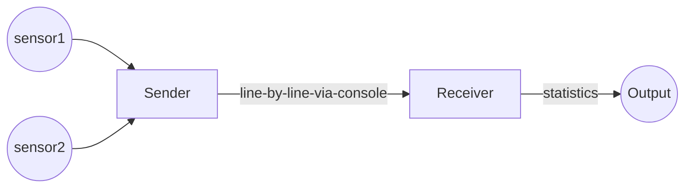

# Sender 

## Overview

## Test Specification

Create a method 'interpretTemperatureAndVoltageFromSensors'.

1) This method takes up the ADC values from Temperature & Voltage sensors and will return the temperature and voltage values seperated by comma \
	Eg: \
		ADC Resolution: 10 bits \
		Temperature Measurement Range: -45 to 85 deg. celcius \
		Voltage Measurement Range: 0 to 60V (based on ISO 6469-3 class A and B: Low voltage class 1: ≤ 30 VAC and ≤ 60 VDC is considered) \
		
		Temperature Sensor ADC Value in 10 bit integer: 100 \
		Voltage Sensor ADC Valuesin 10 bit integer: 600 \

		Output(Temperature, Voltage): -32, 35 

2) Allow method to take ADC values of 'n' bit resolution\

	Eg:\
		ADC Values in 10 bit integer range: i.e 0-1023\
		ADC Values in 12 bit integer range i.e 0-4095\
		ADC Values in 15 bit integer range i.e 0-32767

3) Allow method to take given measurement range for the sensors\
	ie. Temperature Sensor Measurement Range can be any given range\
		1) -45 to 85 deg.c\
		2) 25 to -45 deg.c \
	    Voltage Sensor Measurement Range can be any given range\
		1) 0 to 60V (Low Voltage class)\
		2) 0 to 900V (High Voltage class)

4) Allow method to interpret the temperature and voltage values based on given measurement range from the ADC of 'n' bit resoultion of the corresponding sensors.\
		Temp/Volt = Min.measurement range + ((Max. measurement Range) * (Current ADC value in integer of 'n' bit resolution / Max possible integer value for 'n' bit resolution) * (total measurement range / max measurement value)) 

5) Method have to roundoff the interpreted temperature and voltage values\
	Eg: \
		-32.167 --> -32 \
	    -32.576 --> -33 

6) Allow method to format the interpreted temperature and voltage values in CSV (Comma seperated Values) format\
	Eg: \
		0 , 55 \
		-12, 32	

7) Formatted output has to be printed on console. 

8) Allow method to take stream of input values (Here: Consider 50) \
	Eg:\
		Temperature Sensor ADC Values in 10 bit integer: 100, 1022, 0, 700, 655 ..... 324 \
		Voltage Sensor ADC Values in 10 bit integer: 600, 876, 345, 457, 322 ...... 378 

# Streaming BMS Data

This project is about sending and receiving BMS data.

## Decomposition

At a top level, the program runs in two processes - the sender and the receiver.

The Sender simulates and processes data from sensors. It sends data line-by-line to the console, in a format that it defines.
The Receiver inputs this data and computes statistics.

The Sender sends data to the Receiver using [console redirection and pipes](https://ss64.com/nt/syntax-redirection.html).
They need to run on the command-line as follows:

`sender-executable | receiver-executable`

This would make the console-writes of the sender
become the console-reads of the receiver.
It gives us the flexibility of decoupling the sender and receiver -
they can even be written in different languages.

## Phases

The project is divided into two phases:

- Develop the Sender in the first phase, complete with test cases. The syntax and meaning of the data must be evident by reading your test cases.
Do not develop the Receiver yet.

We will instruct you to handover your Sender to another participant and take-over another Sender.

- Develop the Receiver for the Sender you take-over.

## The Interface

We document the interface between the Sender and the Receiver as test cases.

The Sender and Receiver are testable on their own:

- The Sender is testable without the Receiver - so we can develop
for another sensor, test and be confident about integration.
- The Receiver is testable without the Sender - so we can enhance with additional statistics,
without re-testing against all Senders again.

## Decomposition of responsibility

The naming of source files within the Sender and within the Receiver
give their internal decomposition.

## Minimum Functionality

This section lists the minimum functionality of the Sender and Receiver.

### The Sender

- simulates and sends at least two Battery / Charging parameters
- sends fifty readings in a stream
- can either generate values for the parameters, or read from a file
- uses console output to communicate the parameters.

### The Receiver

- reads the parameters from the console input
- after reading every parameter, it prints the following:
    - maximum and minimum values in the incoming stream
    - [simple moving average](https://www.investopedia.com/terms/s/sma.asp) of the last 5 values

## Quality Parameters

Setup the quality parameters of your project (duplication, complexity, coverage, warnings) using GitHub workflow yml files.
